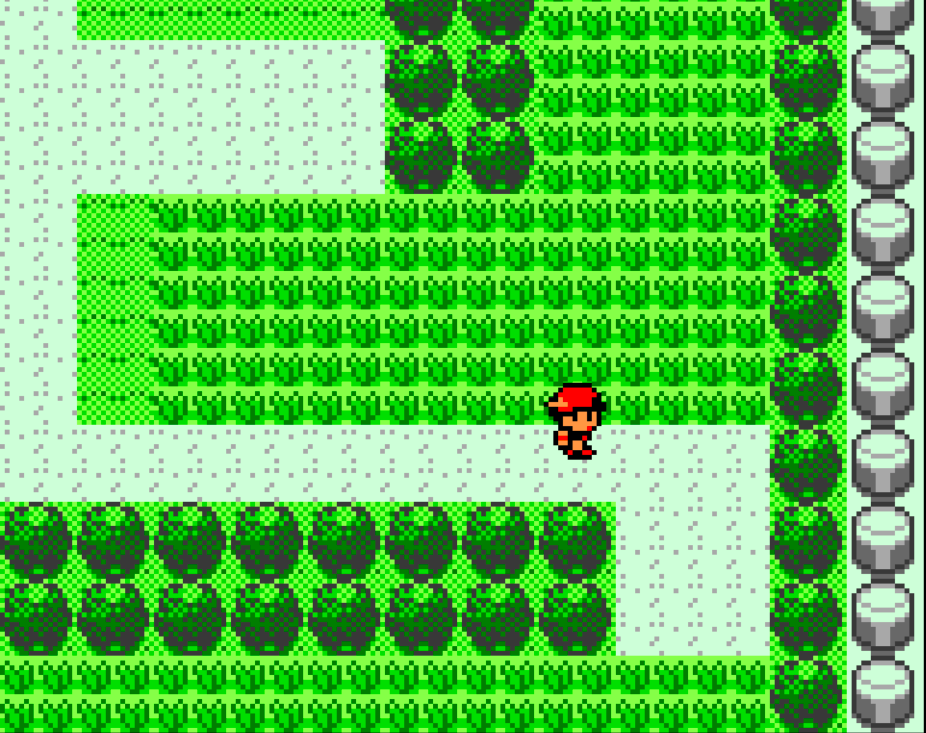
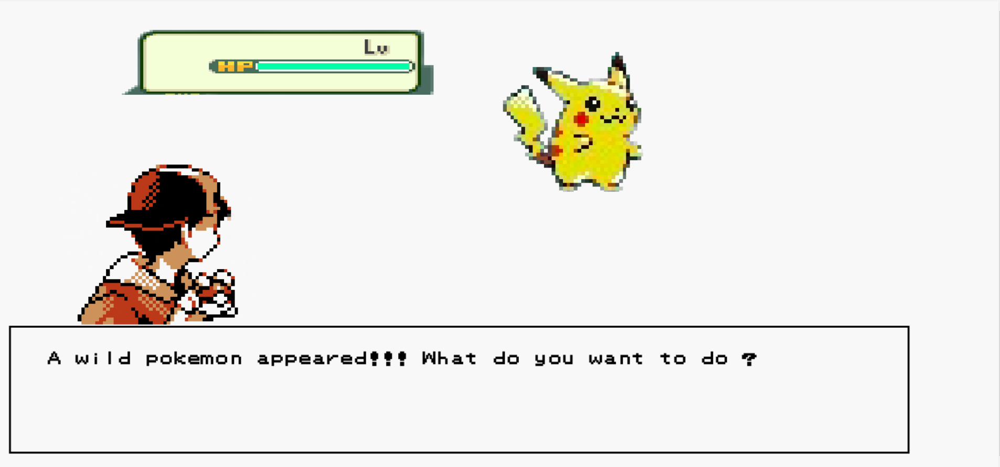
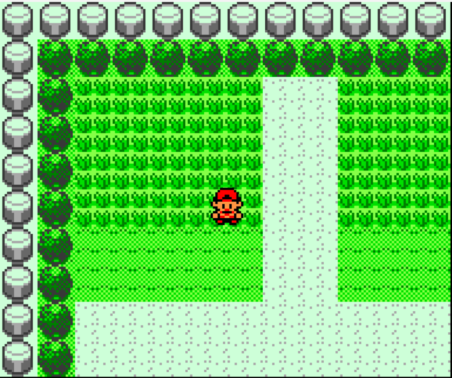

### Ploymon
#### Built for [ETHOdyssey Hackathon 2021](https://devfolio.co/submissions/polymon-d439)
#### 🏆🏆🏆 at **Polygon, Filecoin & The Graph** category

Remaking Pokemon GBA on blockchain.

The classical GBA games were very fun to play. But the game progress made by the user ends up in his device only. With the recent rise of scalable blockchain platforms the game can be recreated providing incentives to both the creators and player.

In Polymon, user enters a map to catch pokemon. The user streams the DAIx token in real-time for the time it spends on the map to catch the pokemon. The tokens paid by the user are distributed to the Map owner, graphic creator, and music creator in real-time. As the Map itself is NFT token so the owner can sell/trade in any NFT marketplace.

The pokemons caught by users truly belong to them. They may trade/sell as their will or create a new map/arena with their pokemon, Also, it can be extended to making another game that takes polymon as an asset. In this way with blockchain tech, users & creators get more freedom and economic incentives in the game world.

### Integrated different blockchain techs as:

⚡ Lightning fast transactions powered Matic Network.

🌊 Superfluid protocol for the live token streaming to pay the graphics creator, music creator in real-time as players play on.

📌 IPFS & NFT.Storage is used to store the NFT metadata.

🌐 Chainlink VRF used to generate the pokemon with random unique stats

💱 Easy login and transaction sign with Portis

📊 TheGraph(superfluid subgraph) is used to query and plot the token streaming in realtime

